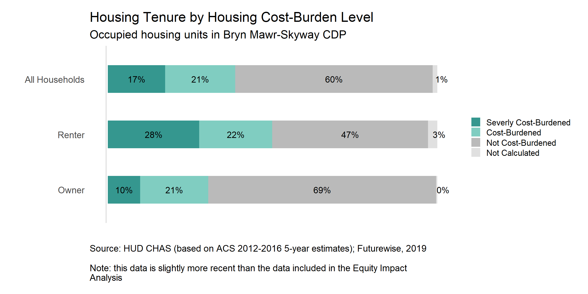

```{r setup, include=FALSE}
knitr::opts_chunk$set(echo = TRUE)
```

## About

This is a project related to King County's Subarea Plan for the Skyway-West Hill Subarea.

More information about the plan, the planning process, and the communities that live in this area can be found on King County's subarea plan website: [Skyway-West Hill Subarea Plan](https://www.kingcounty.gov/depts/local-services/permits/planning-regulations/community-service-area-land-use-subarea-plans/skyway-west-hill.aspx)


## Content

{width=66%}

The following two graphics are based on Exhbits 4 and 5 in the Skyway-West Hill Subarea Plan Equity Impact Analysis (p.7). These graphs show slightly different results from those included in the draft document because they use the most recent CHAS data (2012-2016), which were not yet availabe when the original graphs were produced. The original graphs were created by a third party consultant (BERK Consulting) who prepared the Equity Impact Analysis on behalf of King County.

### Exhibit 4 (Futurewise Version)
{width=66%}

### Exhibit 5 (Futurewise Version)
{width=66%}